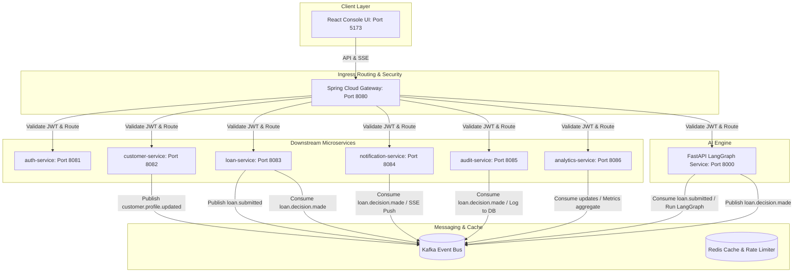

# FinAgent OS

**FinAgent OS** is a production-grade, event-driven agentic AI financial platform that automates loan underwriting, fraud detection, customer financial analysis, and portfolio monitoring using a multi-agent AI architecture.

Instead of a boring CRUD admin panel, all operations are real-time, visualized as a glowing dark-themed "Mission Control" console.

---

## System Architecture



---

## Tech Stack

- **Backend**: Java 21, Spring Boot 3.3.2, Spring Cloud Gateway, Spring Security (Stateless JWT + RBAC), Spring Data JPA, PostgreSQL, Redis, Apache Kafka.
- **AI Service**: Python 3.11, FastAPI, LangGraph (Multi-agent coordination logic: Risk Agent, Fraud Agent, Document Agent, Supervisor Agent).
- **Frontend**: React, TypeScript, Vite, Tailwind CSS, Lucide Icons, Recharts.
- **Metrics**: Spring Boot Actuator, Prometheus Micrometer Gauges.

---

## Quick Setup & Launch

To boot up the complete containerized stack:

1. Clone the repository and navigate to the project workspace root:
   ```bash
   cd FinAgent
   ```
2. Build and launch all microservices and databases in the background:
   ```bash
   docker-compose -f infra/docker-compose.yml up --build -d
   ```
3. Open your web browser and navigate to:
   - **Vite React Console**: `http://localhost:5173`
   - **Kafka UI Portal**: `http://localhost:9000`

---

## Data Seeding

We provide a Python seed script to automatically register roles and trigger clean, high-risk, and warning evaluation runs:

```bash
python seed_data.py
```

This creates:
1. **Alice Green** (`alice@example.com`): Prime profile ($140,000 income, 750 credit score). AI Supervisor automatically evaluates to **APPROVED**.
2. **Bob Miller** (`bob@example.com`): High-risk profile ($22,000 income). AI Supervisor automatically evaluates to **REJECTED**.
3. **Harvey Dent** (`harvey@example.com`): Flagged profile (SSN warning digit, address Gotham City). Evaluated to **UNDER_REVIEW**.
4. Standard profiles for **Loan Officer** (`officer@example.com`), **Risk Analyst** (`analyst@example.com`), and **Admin** (`admin@example.com`).

---

## Walkthrough Demo Script

Follow these steps to experience the complete platform capabilities:

### 1. Customer Interface (Underwriting Pipeline)
1. Navigate to `http://localhost:5173`.
2. Toggle the role selector to **CUSTOMER** and click **Don't have an account? Sign up** to register a customer user, then Sign In.
3. Open the **Apply Loan** tab and submit a loan application. Enter PII values (SSN, Address, Income).
4. Upon clicking submit, observe the **Live Ingress Event Console** ticker. You will see the event stream log:
   - `Application Submitted` -> Dispatched to topic `loan.submitted`.
   - `Bureau Sync` -> Fetching credit file from credit bureau.
   - `AI Decision Node` -> Processing LangGraph parallel evaluation.
5. In the **Workflow Timeline** card, watch the pulsing nodes move through *Application -> Documents -> Risk & Fraud -> Decision*.
6. Review the **Explainable AI** panel card to inspect the supervisor's natural language explanation and matching confidence dial accuracy.
7. Click the **Advisor Health** tab to check recommendations formulated by the advisor agent. Open the **Support Chat** widget to chat with the AI helper.

### 2. Loan Officer Interface (Manual Overrides)
1. Sign Out and select **LOAN_OFFICER** role. Sign In with `officer@example.com` (password `password123`).
2. Go to the **Evaluation Queue** tab. You will see Harvey Dent's application pending in `UNDER_REVIEW` state.
3. Review the AI explanation factors. Click **Override Approve** and type a justification reason.
4. Go to the **System Audit Logs** tab to verify that the override action has been captured in the immutable audit log table.

### 3. Risk Analyst Interface (Portfolio Monitoring)
1. Sign Out, select **RISK_ANALYST** role, and Sign In with `analyst@example.com` (password `password123`).
2. Click the **Portfolio Monitoring** tab. View the list of suspicious customer flags logged by the Portfolio Monitoring Agent.
3. Click the **AI Agent Operations** tab to inspect the health, latencies, loads, and accuracy ratings of each active agent.

### 4. Admin Interface (Immutable Audit logs)
1. Log in with `admin@example.com` (password `password123`).
2. Verify you can access the full audit trail list of system decisions.
3. Try query `/api/audit/loans` using a Customer JWT token via API tools (e.g. Postman) to verify the gateway enforces **403 Forbidden** security boundaries.
